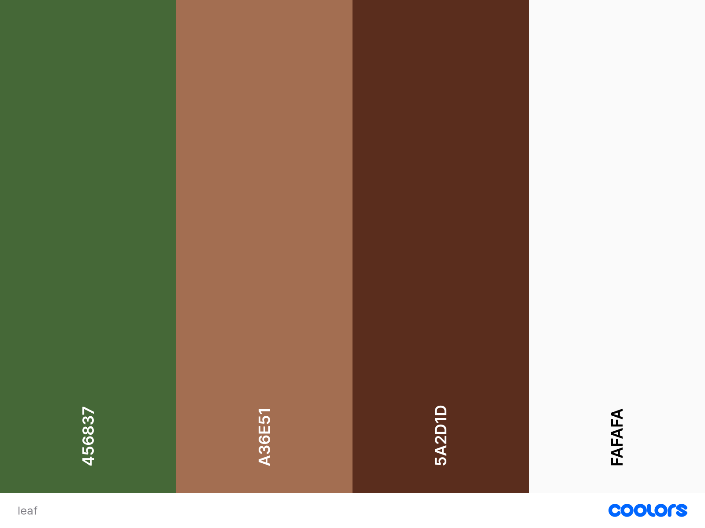

The leafblowers is a NGO organization that works to prevent the results of deforestation and as a result improves the climate. It does this through reforestation projects all over the world. This side offers insight in the program and ways to support. 

User stories
#### First Time Visitor Goals 
As a first-time visitor, I want to learn about the mission and purpose of The Leafblowers organization.
As a first-time visitor, I want to understand the impact of deforestation and the importance of reforestation projects.
As a first-time visitor, I want to know how I can support The Leafblowers' efforts in preventing deforestation and promoting reforestation.<br 
#### Returning Visitor Goals  
As a returning visitor, I want to learn about the progress and updates on ongoing reforestation projects.
As a returning visitor, I want to know about any new initiatives or events organized by The Leafblowers.
As a returning visitor, I want to donate or volunteer to support The Leafblowers' efforts.<br 
#### Frequent User Goals
As a frequent user, I want to stay up-to-date on the latest news and updates on The Leafblowers' reforestation projects.
As a frequent user, I want to track my donations or volunteer hours and see the impact of my contribution.
As a frequent user, I want to connect with other members and volunteers of The Leafblowers and exchange ideas and information.

-   ### Design
    -   #### Colour Scheme

    -   #### Typography

    -   #### Imagery

*   ### Wireframes

    -   Home Page Wireframe -

    -   Mobile Wireframe - 

    -   Contact Us Page Wireframe - 

## Features

-   Responsive on all device sizes

Interactive elements
Landing page, showing aim of organisation.
Info page, showing the different projects on an interactive map
donation page
Useful links
About us

## Technologies Used

### Languages Used

-   [HTML5](https://en.wikipedia.org/wiki/HTML5)
-   [CSS3](https://en.wikipedia.org/wiki/Cascading_Style_Sheets)

### Frameworks, Libraries & Programs Used

## Testing

### Testing User Stories from User Experience (UX) Section

-   #### First Time Visitor Goals

    1. As a First Time Visitor, I want to easily understand the main purpose of the site and learn more about the organisation.

    2. As a First Time Visitor, I want to be able to easily be able to navigate throughout the site to find content.

    3. As a First Time Visitor, I want to look for testimonials to understand what their users think of them and see if they are trusted. I also want to locate their social media links to see their following on social media to determine how trusted and known they are.
 

-   #### Returning Visitor Goals

    1. As a Returning Visitor, I want to find the new programming challenges or hackathons.

    2. As a Returning Visitor, I want to find the best way to get in contact with the organisation with any questions I may have.

    3. As a Returning Visitor, I want to find the Facebook Group link so that I can join and interact with others in the community.

-   #### Frequent User Goals

    1. As a Frequent User, I want to check to see if there are any newly added challenges or hackathons.

    

    2. As a Frequent User, I want to check to see if there are any new blog posts.

      

    3. As a Frequent User, I want to sign up to the Newsletter so that I am emailed any major updates and/or changes to the website or organisation.
      

### Further Testing
On deployment all features and elements tested and functional according to intended outcome

## Deployment

### GitHub Pages

## Credits

### Content

### Media

-   All Images were created by the developer.

### Acknowledgements

-   My Mentor for continuous helpful feedback.

-   Tutor support at Code Institute for their support.
